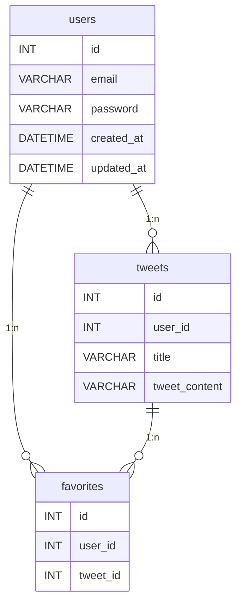

```mermaid
erDiagram

%% 1:0or多
users ||--o{ tweets: "1:n"
users ||--o{ favorites: "1:n"
tweets ||--o{ favorites: "1:n"

users {
  INT id
  VARCHAR email
  VARCHAR password
  DATETIME created_at
  DATETIME updated_at
}

tweets{
  INT id
  INT user_id
  VARCHAR title
  VARCHAR tweet_content
}

favorites{
  INT id
  INT user_id
  INT tweet_id
}
```
